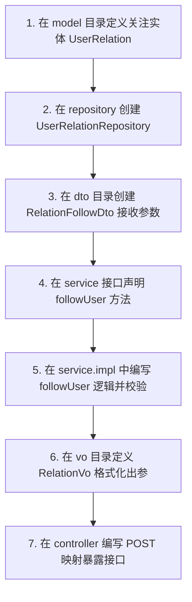

# 抖音短视频 Java 后端开发手册 (Team Collaboration Guide)

欢迎加入 **抖音短视频前后端分离平台** 联合开发团队！本项目后端基于 **Java Spring Boot 3.4.0 + JPA + H2 数据库** 开发，采用工业级分层架构模型。

为了方便团队成员高效并行开发，避免代码冲突，请务必仔细阅读本手册并严格遵守架构规范。

---

## 📂 团队协同分层目录树（企业标准版）

后端的核心源码全部位于 [src/main/java/com/douyin/api/](file:///e:/api课程/api-douyin-backend/src/main/java/com/douyin/api/) 目录下。以下是团队共建的完整包名定义与分工说明：

```text
com.douyin.api/
├── ApiDouyinApplication.java   # Spring Boot 主入口，内置数据库自动播种（Seed）
│
├── controller/                 # 1. 接口暴露层 (REST Controller)
│   │                           # 【分工】：定义前端 API 地址，进行参数基本格式拦截，调用 Service 层逻辑
│   ├── AuthController.java     # 账户与权限管理 API
│   ├── VideoController.java    # 短视频浏览、点赞、发布 API
│   └── AdminController.java    # 开发者后台性能看板 API
│
├── service/                    # 2. 业务契约层 (Service Interfaces)
│   │                           # 【分工】：仅声明业务方法接口定义，起到开发协议隔离作用，方便多人协作
│   └── impl/                   # 3. 业务实现层 (Service Implementations)
│                               # 【分工】：编写具体的业务算法流程（如点赞防刷、推荐算法模型计算）
│
├── model/                      # 4. 数据实体层 (JPA Entities / POJO)
│   │                           # 【分工】：映射数据库表结构，使用 JPA 注解标记主外键和级联删除规则
│   ├── User.java               # 用户实体模型
│   ├── Video.java              # 视频实体模型
│   ├── Like.java               # 点赞映射（复合唯一索引）
│   └── View.java               # 浏览日志（排重使用）
│
├── repository/                 # 5. 数据防线层 (Spring Data JPA Repositories)
│   │                           # 【分工】：负责底层的 SQL 增删改查。使用原生 SQL 或 JPQL 扩展高频操作
│   ├── UserRepository.java     # 用户数据访问
│   ├── VideoRepository.java    # 视频数据访问与协同排重排序
│   ├── LikeRepository.java     # 点赞数据访问
│   └── ViewRepository.java     # 观看日志访问与重置
│
├── dto/                        # 6. 入参对象层 (Data Transfer Objects)
│   │                           # 【分工】：接收前端 RequestBody JSON 参数，配合 Validation 框架进行注解校验
│   └── package-info.java
│
├── vo/                         # 7. 出参视图层 (View Objects)
│   │                           # 【分工】：控制返回给前端的 JSON 数据结构，屏蔽敏感字段（如隐藏 password）
│   └── package-info.java
│
├── config/                     # 8. 系统配置层 (Global Configurations)
│   │                           # 【分工】：拦截器注册、全局 CORS 策略配置、本地上传文件映射等
│   ├── JwtInterceptor.java     # Bearer Token 身份切面校验器
│   ├── JwtUtil.java            # JWT 加解密模块
│   ├── RequestLoggerFilter.java# 性能日志捕捉过滤器
│   └── WebConfig.java          # MVC 全局跨域与物理文件路由映射
│
├── exception/                  # 9. 异常管理层 (Custom Exceptions & Global Handler)
│   │                           # 【分工】：定义全局异常捕获器，统一输出 JSON 格式的友好错误提示
│   └── package-info.java
│
├── aspect/                     # 10. 切面注入层 (AOP Aspects)
│   │                           # 【分工】：定义统一操作日志审计切面、接口防刷限流切面
│   └── package-info.java
│
└── utils/                      # 11. 基础工具层 (Utility Helpers)
                                # 【分工】：存放纯静态公共方法（如 MD5、文件转换、网络工具等）
                                # 【注意】：工具类中不可注入 Spring Bean
```

---

## 🤝 协作开发流程规范

### 1. 新增 API 的标准开发路径 (流程图)
当您的团队成员需要开发一个新的接口时（比如“关注创作者”功能），**强烈推荐** 遵循以下开发路径：



### 2. 数据库变更规则
*   本项目采用了嵌入式持久化 **H2 数据库**。
*   `spring.jpa.hibernate.ddl-auto` 已配置为 `update`，当您或团队在 `model/` 中新增实体或在原有类中添加新字段时，**Hibernate 会在服务器重启时自动完成增量修改，无需手动写 SQL 建表！**
*   如果您需要重新生成数据库测试默认数据，只需删除项目根目录下的整个 **`data`** 目录，重新运行 `mvn spring-boot:run` 即可自动重建！

### 3. 代码提交前自测规范
在提交代码给团队之前，请务必保证后端代码编译 100% 正常：
```powershell
# 执行 Maven 清理并编译所有类，确保无任何语法错误
mvn clean compile
```

---

## 🛡️ 安全合规与规范要求

1.  **JWT 认证保障**：除了 `/api/register` 和 `/api/login` 之外，所有新增的 `/api/**` 请求均会被 `JwtInterceptor` 拦截。
    *   在 Service 中，可以直接通过 `HttpServletRequest` 的属性获取当前操作用户的 UID：
        ```java
        Long userId = (Long) request.getAttribute("userId");
        ```
2.  **大文件上传限制**：系统支持的单次最大文件上传上限在 `application.properties` 中已配置为 **`100MB`**，可满足常见 4K 高画质短视频的开发演示。

大家一起加油，打造最流畅、最精美的抖音短视频开发学习案例！💻✨