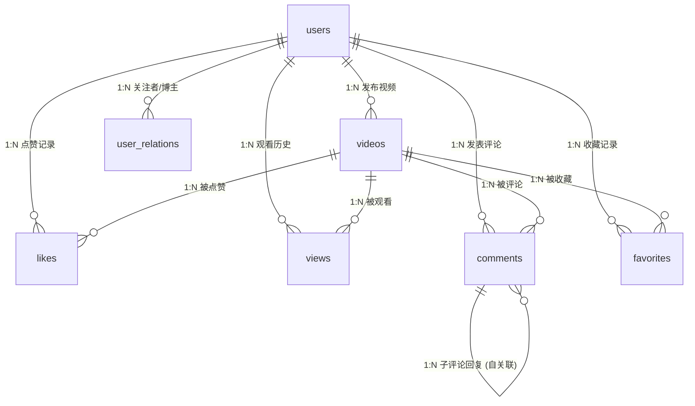

# 🗄️ 抖音短视频 - 数据库设计与优化规范 (Database Design & Optimization Guide)

本系统后端基于 **Java 21 + Spring Boot 3.4.0 + Spring Data JPA + PostgreSQL** 架构构建。为保障短视频社交平台的高并发、强互动、海量推荐流去重等业务场景的高效运转，特制定本数据库设计文档。

---

## 🧭 整体实体关系图 (Entity-Relationship Diagram)

以下是平台核心业务与扩展社交业务的实体关系图（ER 图），清晰展现了用户、视频、互动与日志流之间的一对多（1:N）和多对多（N:M）关联。



---

## 🗂️ 核心业务数据表设计 (Core Schemas)

以下是当前系统已实现的核心实体类对应的 PostgreSQL 数据库表设计。所有核心表结构在 Spring Boot 启动时，通过 JPA 自动映射和同步至 PostgreSQL 数据库。

### 1. 用户表 (`users`)
*   **物理表名**：`users`
*   **用途说明**：存储用户账号、密码及基本个人资料，用作 JWT 无状态鉴权的账户验证防线；`last_like_notification_read_at` 用于 F14「谁赞了我的视频」通知的已读水位线。
*   **表结构设计**：

| 字段名称 (Column) | 物理类型 (PostgreSQL) | 约束与属性 (Constraints) | 默认值 (Default) | 描述与业务意义 (Description) |
| :--- | :--- | :--- | :--- | :--- |
| `id` | `BIGINT` | PRIMARY KEY, AUTO_INCREMENT | - | 用户唯一自增 ID |
| `username` | `VARCHAR(32)` | UNIQUE, NOT NULL | - | 登录账号 (最长 32 位) |
| `password_hash` | `TEXT` | NOT NULL | - | 密码的 BCrypt 安全哈希值 |
| `display_name` | `VARCHAR(64)` | NOT NULL | - | 用户公开昵称 (默认同 username) |
| `avatar_url` | `VARCHAR(255)` | NULL | - | 用户头像 URL |
| `bio` | `VARCHAR(255)` | NULL | - | 个人简介 |
| `status` | `VARCHAR(20)` | NOT NULL | `'active'` | 账号状态: `active`(正常), `frozen`(冻结) |
| `created_at` | `TIMESTAMP` | NOT NULL | - | 账号注册时间 |
| `updated_at` | `TIMESTAMP` | NOT NULL | - | 账号信息更新时间 |
| `last_like_notification_read_at` | `TIMESTAMP` | NULL | `NULL` | 上次标记点赞通知已读的时间；`NULL` 表示全部未读 |

*   **索引规划 (Indexes)**：
    *   `uq_users_username` (Unique): 基于 `username` 自动生成的唯一索引，保障登录时高效率检索。
*   **结构变更脚本**：`docs/migrations/001_add_last_like_notification_read_at.sql`
*   **JPA 映射类**：`com.douyin.api.model.User`

---

### 2. 视频表 (`videos`)
*   **物理表名**：`videos`
*   **用途说明**：存储短视频的标题、内容描述、存储 URL、封面图以及点赞数等元数据信息。
*   **表结构设计**：

| 字段名称 (Column) | 物理类型 (PostgreSQL) | 约束与属性 (Constraints) | 默认值 (Default) | 描述与业务意义 (Description) |
| :--- | :--- | :--- | :--- | :--- |
| `id` | `BIGINT` | PRIMARY KEY, AUTO_INCREMENT | - | 视频唯一自增 ID |
| `user_id` | `BIGINT` | FOREIGN KEY (users.id), NOT NULL | - | 视频创作者的 ID (博主 ID) |
| `title` | `VARCHAR(255)` | NOT NULL | - | 视频标题 |
| `description` | `VARCHAR(1000)` | NULL | - | 视频补充性描述信息 |
| `video_url` | `VARCHAR(255)` | NOT NULL | - | 视频物理文件存储路径或 OSS 访问链接 |
| `cover_url` | `VARCHAR(255)` | NULL | - | 视频第一帧封面图的访问链接 |
| `likes_count` | `INTEGER` | NOT NULL | `0` | 视频获得的点赞总数 (用于推荐流排序) |
| `created_at` | `TIMESTAMP` | NOT NULL | - | 视频上传与发布时间 |

*   **索引规划 (Indexes)**：
    *   `idx_videos_user_id`: 基于 `user_id` 建立单列索引，加速“用户个人主页-我的视频”列表分页查询。
    *   `idx_videos_likes_desc`: 基于 `likes_count DESC, created_at DESC` 建立复合降序索引，针对“视频推荐主页按热门/点赞数倒序推荐”场景做索引覆盖。
*   **JPA 映射类**：`com.douyin.api.model.Video`

---

### 3. 点赞记录表 (`likes`)
*   **物理表名**：`likes`
*   **用途说明**：记录用户与视频之间的多对多点赞关联。保证一个用户对同一个视频只能点赞一次，并作为防高并发下“点赞抖动”和重复写入的防线。
*   **表结构设计**：

| 字段名称 (Column) | 物理类型 (PostgreSQL) | 约束与属性 (Constraints) | 默认值 (Default) | 描述与业务意义 (Description) |
| :--- | :--- | :--- | :--- | :--- |
| `id` | `BIGINT` | PRIMARY KEY, AUTO_INCREMENT | - | 自增主键 ID |
| `user_id` | `BIGINT` | FOREIGN KEY (users.id), NOT NULL | - | 点赞用户的 ID |
| `video_id` | `BIGINT` | FOREIGN KEY (videos.id), NOT NULL | - | 被点赞的视频 ID |
| `created_at` | `TIMESTAMP` | NOT NULL | - | 点赞触发时间 |

*   **索引与约束规划 (Indexes & Constraints)**：
    *   `uq_likes_user_video` (Unique Constraint): 在 `(user_id, video_id)` 上创建**联合唯一索引**，数据库底层防御重复点赞，保证点赞操作的幂等性。
*   **关联业务查询 (F14 点赞通知)**：
    *   `GET /api/v1/users/me/like-notifications` 通过 `likes` 联表 `videos`、`users` 查询「他人对我发布视频的点赞」。
    *   过滤条件：`videos.user_id = 当前用户` 且 `likes.user_id <> 当前用户`（排除自己给自己点赞）。
    *   单条通知是否已读：比较 `likes.created_at` 与 `users.last_like_notification_read_at`。
*   **JPA 映射类**：`com.douyin.api.model.Like`

---

### 4. 观看历史与去重表 (`views`)
*   **物理表名**：`views`
*   **用途说明**：记录用户观看过某个视频的历史状态。用于在推荐视频流逻辑中剔除已观看的内容，实现高体验的“观看去重”（F02）。
*   **表结构设计**：

| 字段名称 (Column) | 物理类型 (PostgreSQL) | 约束与属性 (Constraints) | 默认值 (Default) | 描述与业务意义 (Description) |
| :--- | :--- | :--- | :--- | :--- |
| `id` | `BIGINT` | PRIMARY KEY, AUTO_INCREMENT | - | 自增主键 ID |
| `user_id` | `BIGINT` | FOREIGN KEY (users.id), NOT NULL | - | 观看用户的 ID |
| `video_id` | `BIGINT` | FOREIGN KEY (videos.id), NOT NULL | - | 被观看的视频 ID |
| `created_at` | `TIMESTAMP` | NOT NULL | - | 观看产生时间 |

*   **索引与约束规划 (Indexes & Constraints)**：
    *   `uq_views_user_video` (Unique Constraint): 在 `(user_id, video_id)` 建立唯一索引，防止单个用户观看多次而导致数据库表产生冗余行，同时极大优化推荐接口的 `NOT IN` 检索速度。
*   **JPA 映射类**：`com.douyin.api.model.View`

---

## 📈 扩展社交与日志监控表设计 (Extensions)

为了满足更完整的抖音级社交互动需求以及管理端后台性能审计，系统建议引入以下扩展表结构。

### 5. 社交关注关系表 (`user_relations`)
*   **物理表名**：`user_relations`
*   **用途说明**：存储用户之间的关注和粉丝关系，支持关注视频流以及个人页面的粉丝数、关注数展示。
*   **表结构设计**：

```sql
CREATE TABLE user_relations (
    id BIGSERIAL PRIMARY KEY,
    follower_id BIGINT NOT NULL,                -- 关注者 ID (粉丝)
    following_id BIGINT NOT NULL,               -- 被关注者 ID (博主)
    created_at TIMESTAMP NOT NULL,
    CONSTRAINT uq_follower_following UNIQUE (follower_id, following_id),
    CONSTRAINT fk_relations_follower FOREIGN KEY (follower_id) REFERENCES users(id) ON DELETE CASCADE,
    CONSTRAINT fk_relations_following FOREIGN KEY (following_id) REFERENCES users(id) ON DELETE CASCADE
);
```
*   **优化索引**：
    *   `idx_relations_follower_idx`: 基于 `follower_id` 建立索引，用于极速查询当前用户**“关注了谁”**。
    *   `idx_relations_following_idx`: 基于 `following_id` 建立索引，用于极速查询当前用户**“拥有哪些粉丝”**。

### 6. 视频评论表 (`comments`)
*   **物理表名**：`comments`
*   **用途说明**：存储视频下方的用户评论。支持单级评论和两级树状回复（自关联）。
*   **表结构设计**：

```sql
CREATE TABLE comments (
    id BIGSERIAL PRIMARY KEY,
    video_id BIGINT NOT NULL,                   -- 关联的视频 ID
    user_id BIGINT NOT NULL,                    -- 发表评论的用户 ID
    parent_id BIGINT DEFAULT NULL,              -- 父评论 ID (第一级为 NULL，子回复指向父 ID)
    content TEXT NOT NULL,                      -- 评论具体内容
    created_at TIMESTAMP NOT NULL,
    CONSTRAINT fk_comments_video FOREIGN KEY (video_id) REFERENCES videos(id) ON DELETE CASCADE,
    CONSTRAINT fk_comments_user FOREIGN KEY (user_id) REFERENCES users(id) ON DELETE CASCADE,
    CONSTRAINT fk_comments_parent FOREIGN KEY (parent_id) REFERENCES comments(id) ON DELETE SET NULL
);
```
*   **优化索引**：
    *   `idx_comments_video_tree`: 建立 `video_id, parent_id, created_at DESC` 的联合索引，用于在打开视频评论区时极速分层渲染。

### 7. 接口请求日志持久化表 (`request_logs`)
*   **物理表名**：`request_logs`
*   **用途说明**：系统通过 RequestLoggerFilter 对所有 /api/v1 请求进行统一拦截，
    异步持久化至本表，支持后台管理端（AdminController）拉取全量
    接口耗时统计与异常排查。记录字段包含请求追踪 ID、登录用户及
    客户端 IP，敏感字段（password、token）在写入前统一脱敏处理。
*   **表结构设计**：

```sql
CREATE TABLE request_logs (
                              id BIGSERIAL PRIMARY KEY,
                              method VARCHAR(10) NOT NULL,                -- 请求方法: GET/POST/PUT/DELETE
                              url VARCHAR(255) NOT NULL,                  -- API 请求路径
                              status_code INTEGER NOT NULL,               -- HTTP 响应状态码 (如 200, 401, 403, 500)
                              duration_ms BIGINT NOT NULL,                -- 接口响应耗时 (毫秒)
                              request_body TEXT,                          -- 入参数据 JSON (最长 1000 字符)
                              response_body TEXT,                         -- 响应出参 JSON (最长 1000 字符)
                              timestamp TIMESTAMP DEFAULT CURRENT_TIMESTAMP NOT NULL,
                              trace_id VARCHAR(32),                       -- 请求唯一追踪 ID
                              user_id BIGINT,                             -- 当前登录用户 ID（未登录为 NULL）
                              user_ip VARCHAR(45)                         -- 客户端 IP 地址
);
```
*   **优化索引**：
    *   `idx_logs_timestamp`: 基于请求时间检索。
    *   `idx_logs_performance`: 基于 `duration_ms` 建立降序索引，用于迅速找出系统最慢的“瓶颈接口”。
    *   `idx_logs_user_id`: 基于 `user_id` 建立索引，支持按用户查询请求历史。

---

## ⚡ 针对短视频高并发的数据库设计优化策略

由于抖音短视频属于典型的**“多读少写、读热写密”**的业务模型，随着数据规模扩张，必须在数据库层面做好如下优化保障：

1.  **强防线外键与级联配置 (`On Delete Cascade`)**
    为防止出现孤儿数据、脏数据，系统建表时应设定严格的外键关系。当用户账号被注销（物理删除）时，通过 `ON DELETE CASCADE` 级联删除该用户对应的视频、点赞历史、观看历史以及社交关系，减小数据维护成本。
2.  **避免物理删除推荐流数据**
    为保护用户数据的审计和分析价值，对视频的“删除操作”（F07）可以使用“逻辑删除标记”实现（在 `videos` 表增加 `status` 字段或 `is_deleted` 布尔值字段，默认为 `false`，删除时仅做标记），在推荐或列表查询时通过 SQL 过滤。
3.  **高并发点赞去抖动设计**
    如果在高并发下点赞对 PostgreSQL 压力过大，工业级方案通常使用 **Redis** 作为缓存级防线：
    *   用户点赞时，直接在 Redis 维护一个 `Set`（如 `video:like:{id}` 包含用户 ID 集合），以及累加 Redis 计数器。
    *   后台定时任务（或延迟双删/消息队列）再将点赞数和记录异步刷入 PostgreSQL，极大保护数据库。
4.  **去重逻辑物理瓶颈防范**
    在实现推荐流去重逻辑时，随着用户看过的视频越来越多，`views` 历史数据表可能膨胀至数亿级。此时，直接在 SQL 中采用 `video_id NOT IN (SELECT video_id FROM views WHERE user_id = X)` 的性能将骤然下降。
    *   **优化举措**：在系统达到一定规模时，使用 **Bloom Filter（布隆过滤器）** 缓存用户已看视频的 `video_id` 集合，在内存中直接进行过滤去重，不与 PostgreSQL 发生直接复杂联查。
