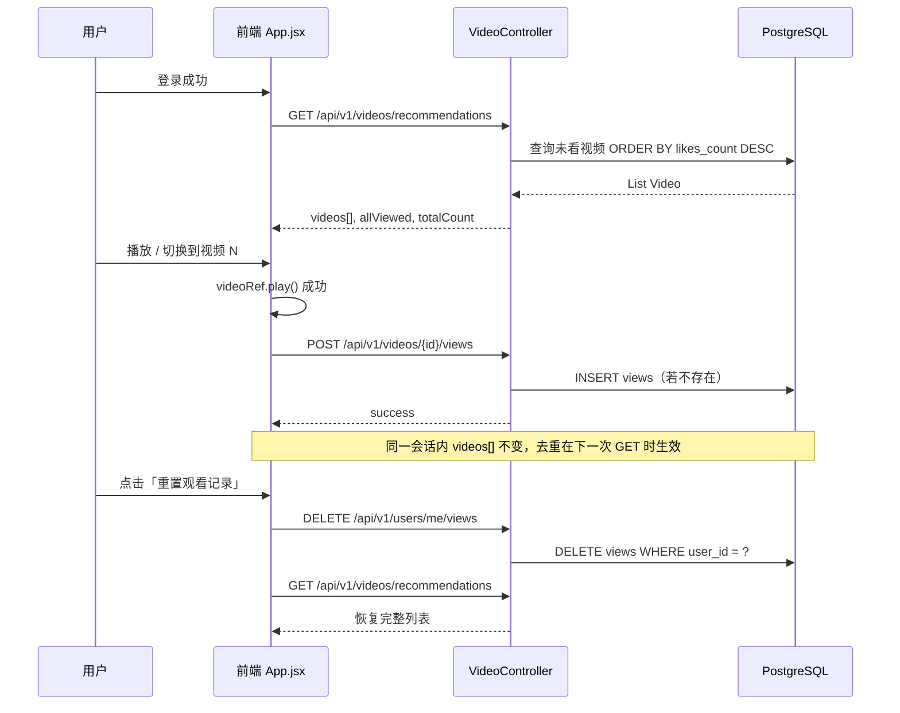

# F02 / F03 观看记录、去重与视频切换方案

> **负责人**：组员 A  
> **关联接口文档**：`docs/F02-F03-推荐流接口草稿.md`  
> **关联规范**：`docs/API_DESIGN_GUIDE.md`  
> **最后更新**：2026-05-22

---

## 1. 目标与范围

| 编号 | 目标 | 本方案覆盖 |
| --- | --- | --- |
| F02 | 按点赞数倒序推荐；已看视频不再推荐 | 数据表、写入时机、查询去重、重置 |
| F03 | 支持上下滑动切换上一条 / 下一条 | 交互方式、前端状态、与接口的对应关系 |

**不在本周范围**：推荐算法个性化、分页加载、每次切换单独 `GET` 下一条接口。

---

## 2. 数据模型

### 2.1 `views` 表（观看历史）

| 字段 | 类型 | 说明 |
| --- | --- | --- |
| `id` | BIGINT PK | 自增主键 |
| `user_id` | BIGINT | 观看用户，关联 `users.id` |
| `video_id` | BIGINT | 被观看视频，关联 `videos.id` |

**约束**：`UNIQUE (user_id, video_id)` —— 保证去重存储，防止重复记录。

### 2.2 与推荐查询的关系

```sql
-- 逻辑等价于 VideoRepository JPQL
SELECT v FROM Video v
WHERE v.id NOT IN (
  SELECT vi.videoId FROM View vi WHERE vi.userId = :userId
)
ORDER BY v.likesCount DESC
```

- **排序**：`likes_count DESC`（F02 评分要求）
- **过滤**：当前用户已出现在 `views` 中的 `video_id` 全部排除

---

## 3. 观看记录与去重流程

### 3.1 时序图



### 3.2 写入时机（前端）

| 事件 | 是否写入 `views` | 说明 |
| --- | --- | --- |
| 登录后首次拉列表 | 否 | 仅 `GET recommendations` |
| 视频 `play()` Promise 成功 | **是** | `recordVideoView(videos[currentIndex].id)` |
| 仅切换索引、播放被浏览器拦截 | 否 | 需用户点击播放后才写入 |
| 暂停 / 未播放完就切走 | 视是否已成功 `play()` | 已成功播放过的会已写入 |

实现位置：`api-douyin-frontend/src/App.jsx` 中 `useEffect([currentIndex, videos])`。

### 3.3 去重生效时机

| 场景 | 用户是否还能在同一会话列表里看到该视频 |
| --- | --- |
| 刚 `POST views` 成功，未重新 `GET` | **能**（本地 `videos` 数组未变） |
| 再次 `GET recommendations` | **不能**（后端已排除） |
| `DELETE users/me/views` 后 `GET` | **能**（历史已清空） |

**设计说明**：会话内列表不变可减少频繁请求，符合「批量拉取 + 本地切换」模式。若验收要求「看完立即从列表消失」，可在 `recordVideoView` 成功后增加 `setVideos(prev => prev.filter(...))` 或调用 `fetchRecommendations()`（二期可选）。

### 3.4 幂等与异常

| 情况 | 行为 |
| --- | --- |
| 重复 `POST` 同一 `(user_id, video_id)` | `existsByUserIdAndVideoId` 为 true 时跳过 INSERT，仍返回 `200` |
| 未登录调用 | `401`，JWT 拦截器 |
| 视频 ID 不存在 | 仍可插入 view 记录（当前实现未校验视频存在性，联调时使用种子 ID） |

---

## 4. F03 视频切换交互方案（已定稿）

### 4.1 选定方案：批量推荐 + 本地索引切换

| 对比项 | 方案 A（本项目采用） | 方案 B（未采用） |
| --- | --- | --- |
| 列表来源 | 一次 `GET recommendations` 拿全量未看列表 | 每次切换 `GET .../next` |
| 切换成本 | 仅改 `currentIndex`，换 `<video src>` | 每次切换都打后端 |
| 与 REST 设计 | 符合现有 `API_DESIGN_GUIDE.md` | 需新增非标准子资源 |
| 与分工文档 | `项目分工.md` 将 F03 与推荐 GET 关联 | 大作业模板中的 `/feed/next` 示例 |

**结论**：采用方案 A；切换时触发的网络请求为 **`POST /videos/{id}/views`**，不是再次 `GET` 下一条。

### 4.2 用户操作映射

| 用户操作 | 前端处理 | 网络请求 |
| --- | --- | --- |
| 滚轮向下（`deltaY > 30`） | `currentIndex + 1`，800ms 防抖锁 | 新片播放成功后 `POST views` |
| 滚轮向上（`deltaY < -30`） | `currentIndex - 1` | 同上 |
| 点击「下一条」箭头 | `handleNextVideo` | 同上 |
| 点击「上一条」箭头 | `handlePrevVideo` | 同上 |
| 已是最后一条 | Toast 提示，不增索引 | 无 |
| 已是第一条上滑 | 忽略 | 无 |

实现位置：`handleNextVideo`、`handlePrevVideo`、`handleWheel`（`App.jsx`）。

### 4.3 推荐页基础结构

当前为单页 `App.jsx`，登录后主界面左侧为「手机壳」推荐区：

```
App
├── 认证区（未登录）
│   ├── 登录 / 注册表单
│   └── apiFetch → POST /auth/login | register
└── 主面板（已登录）
    ├── 推荐流区（F01 + F02 + F03 + F04 展示）
    │   ├── 状态：videos, currentIndex, isLoadingFeed, allViewed
    │   ├── <video ref={videoRef}> 当前 videos[currentIndex]
    │   ├── 标题 / 作者 / 点赞数 / 点赞按钮
    │   ├── 滚轮 onWheel → handleWheel
    │   ├── 上一条 / 下一条按钮
    │   └── 重置观看记录 → handleResetViews
    └── 开发者监控区
        ├── GET /admin/stats
        └── GET /admin/request-logs（用于验收「切换触发请求」）
```

**本周结构交付**：维持单文件即可满足「基础结构」；后续可拆分为 `FeedPanel.jsx` + `useFeed.js`，不改变接口约定。

---

## 5. 测试数据

种子由 `ApiDouyinApplication` 在库为空时写入，至少 6 条视频，点赞数用于验证排序：

| 顺序 | 标题（示意） | likes_count |
| --- | --- | --- |
| 1 | DCloud 移动端跨平台技术 | 580 |
| 2 | 可爱小熊步行动画 | 450 |
| 3 | 火山引擎特效展示 | 320 |
| 4 | 七牛云 2K 色彩解码 | 290 |
| 5 | 七牛云 1080P | 140 |
| 6 | 云上流媒体解析数据 | 60 |

默认账号：`douyin_creator` / `password123`。

---

## 6. 验收对照清单

### F02

- [ ] `GET /api/v1/videos/recommendations` 返回未看视频，按 `likes_count` 降序
- [ ] `POST /api/v1/videos/{id}/views` 后，再次 GET 不包含该视频
- [ ] `DELETE /api/v1/users/me/views` 后，推荐列表恢复
- [ ] 字段含 `title`、`creator_name`、`video_url`、`likes_count`、`is_liked` 等（见接口草稿）

### F03

- [ ] 滚轮或箭头可切换上一条 / 下一条
- [ ] 切换后新视频能播放；监控面板出现 `POST .../views`
- [ ] 登录时出现 `GET .../recommendations`

### 与课程表述的差异说明（答辩可用）

验收清单中的「切换 API」在本项目中指：**切换行为联动观看记录 API**；推荐列表在会话开始时通过 **`GET recommendations`** 一次性加载，切换本身不重复请求 GET。与 `docs/F02-F03-推荐流接口草稿.md` §4 一致。

---

## 7. 已知限制与可选优化

| 项 | 说明 | 优先级 |
| --- | --- | --- |
| 会话内列表不剔除已看 | `POST views` 后仍可在当前 `videos` 中回看 | 低，可文档说明 |
| 无分页 | 一次返回全部未看视频 | 低 |
| 无独立 DTO | 响应用 `Map` 组装 | 中，重构时不改字段名 |
| Legacy `public/js` | 仍使用旧路径 `/api/videos/recommend` | 低，React 前端已对齐 v1 |

---

## 8. 变更记录

| 日期 | 说明 |
| --- | --- |
| 2026-05-22 | 初稿：观看去重、切换方案、页面结构、验收清单 |
